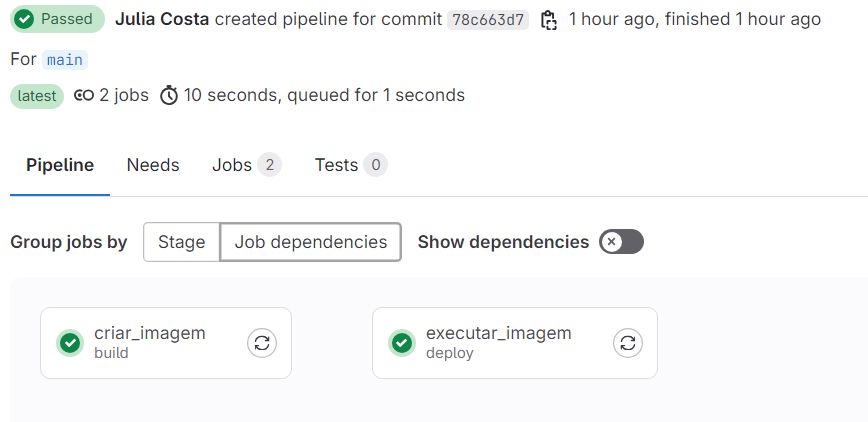

# Case DevOps

## Ferramentas Utilizadas

- AWS
- Terraform
- Docker
- GitLab
- GitLab Runner
- ShellScript
- HTML, CSS e Javascript

## Funcionalidade da aplicação

Todo o programa foi desenvolvido de modo que criasse e gerasse automaticamente a imagem em docker e rodasse o container. O gitLab foi utilizado para automatizar o processo de CI/CD e subir as novas versões apenas com o commit, removendo o container anterior da aplicação mas deixando a imagem, permitindo um rollback

